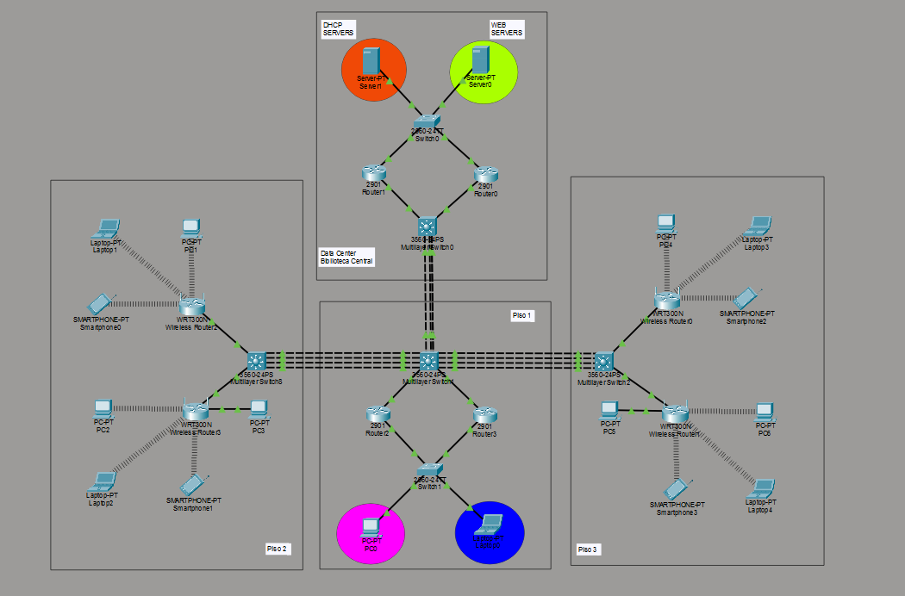
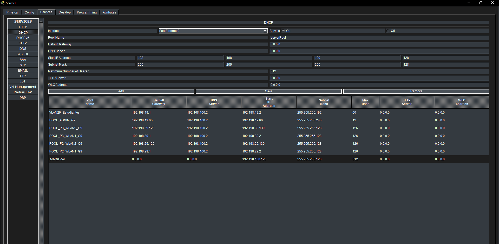
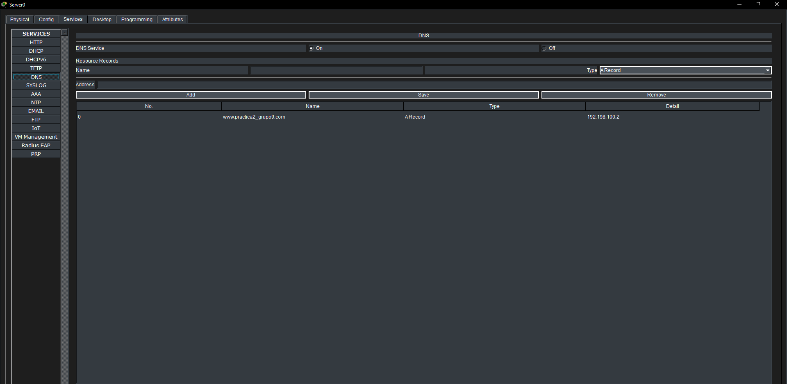
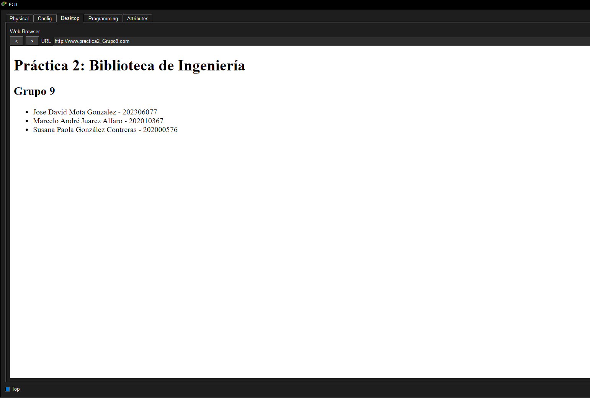
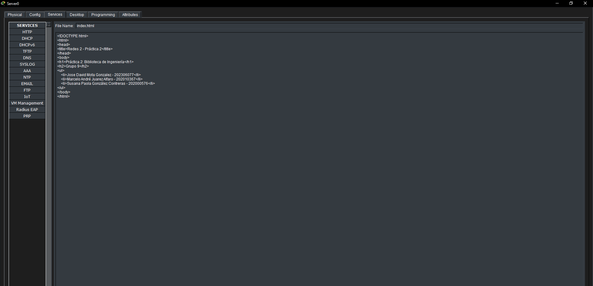
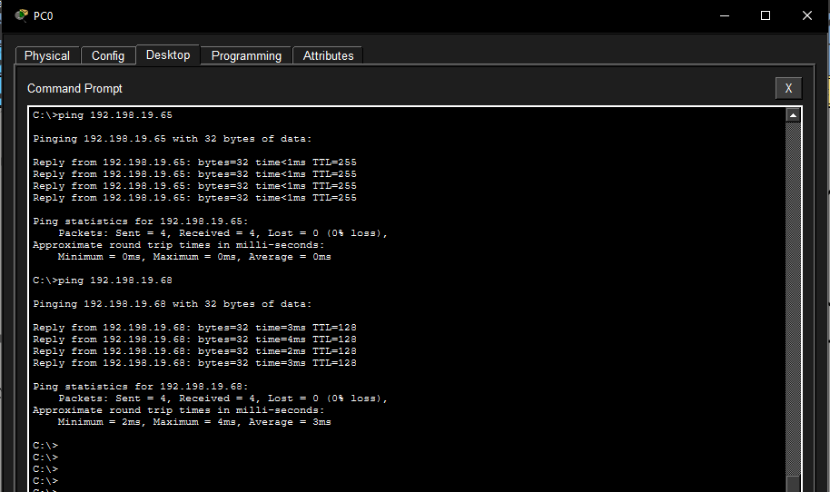
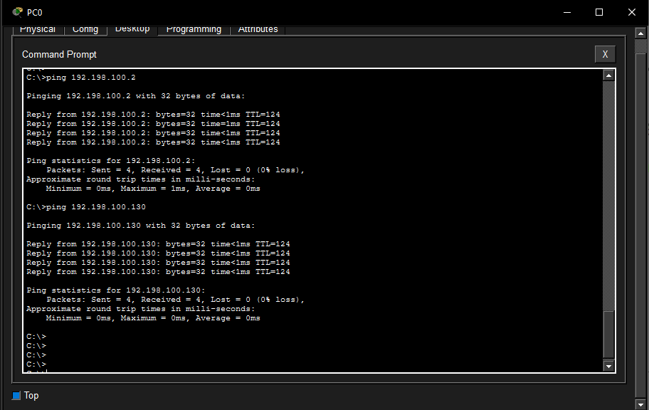
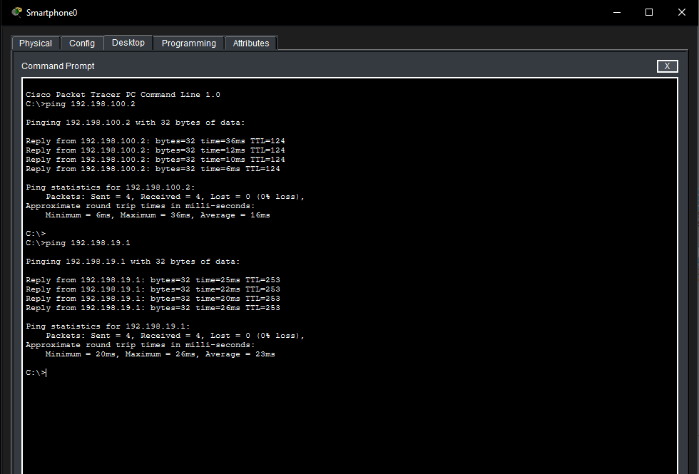
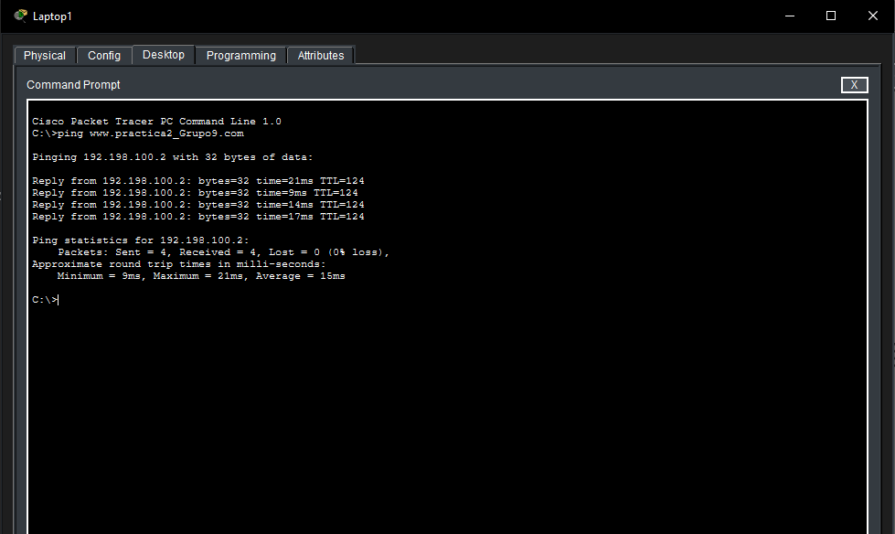

## Topología Propuesta

## Diseño de Arquitectura y Subnetting (VLSM y FLSM)

| Ubicación | VLAN | Subred Asignada | Máscara / CIDR | Rango de Hosts Utilizables |
| :--- | :--- | :--- | :--- | :--- |
| Piso 1 | Estudiantes (29) | 192.198.19.0 | 255.255.255.192 (/26) | 192.198.19.1 - 192.198.19.62 |
| Piso 1 | Admin (19) | 192.198.19.64 | 255.255.255.240 (/28) | 192.198.19.65 - 192.198.19.78 |
| Piso 2 | WLAN1 | 192.198.29.0 | 255.255.255.128 (/25) | 192.198.29.1 - 192.198.29.126 |
| Piso 2 | WLAN2 | 192.198.29.128 | 255.255.255.128 (/25) | 192.198.29.129 - 192.198.29.254 |
| Piso 3 | WLAN1 | 192.198.39.0 | 255.255.255.128 (/25) | 192.198.39.1 - 192.198.39.126 |
| Piso 3 | WLAN2 | 192.198.39.128 | 255.255.255.128 (/25) | 192.198.39.129 - 192.198.39.254 |
| Datacenter | Web (39) | 192.198.100.0 | 255.255.255.128 (/25) | 192.198.100.1 - 192.198.100.126 |
| Datacenter | DHCP (49) | 192.198.100.128 | 255.255.255.128 (/25) | 192.198.100.129 - 192.198.100.254 |

## Tabla de Asignación de Subredes (/30)
| Enlace Punto a Punto | Subred Asignada | Rango Utilizable | Configuración de IPs |
| :--- | :--- | :--- | :--- |
| Multicapa Piso 1 - Router0 | 10.2.9.0/30 | 10.2.9.1 - 10.2.9.2 | Multicapa: 10.2.9.1 / Router0: 10.2.9.2 |
| Multicapa Piso 1 - Router1 | 10.2.9.4/30 | 10.2.9.5 - 10.2.9.6 | Multicapa: 10.2.9.5 / Router1: 10.2.9.6 |
| Multicapa Datacenter - Router2 | 10.2.9.20/30 | 10.2.9.21 - 10.2.9.22 | Multicapa: 10.2.9.21 / Router2: 10.2.9.22 |
| Multicapa Datacenter - Router3 | 10.2.9.24/30 | 10.2.9.25 - 10.2.9.26 | Multicapa: 10.2.9.25 / Router3: 10.2.9.26 |

### Pools DHCP Configuradas

| Pool Name | Default Gateway | DNS Server | Start IP Address | Subnet Mask | Max User | TFTP Server | WLC Address |
| :--- | :--- | :--- | :--- | :--- | :--- | :--- | :--- |
| VLAN29_Estudiantes | 192.198.19.1 | 192.168.100.2 | 192.198.19.2 | 255.255.255.192 | 60 | 0.0.0.0 | 0.0.0.0 |
| POOL_ADMIN_G9 | 192.198.19.65 | 192.198.100.2 | 192.198.19.66 | 255.255.255.240 | 12 | 0.0.0.0 | 0.0.0.0 |
| POOL_P3_WLAN2_G9 | 192.198.39.129 | 192.198.100.2 | 192.198.39.130 | 255.255.255.128 | 126 | 0.0.0.0 | 0.0.0.0 |
| POOL_P3_WLAN1_G9 | 192.198.39.1 | 192.198.100.2 | 192.198.39.2 | 255.255.255.128 | 126 | 0.0.0.0 | 0.0.0.0 |
| POOL_P2_WLAN2_G9 | 192.198.29.129 | 192.198.100.2 | 192.198.29.130 | 255.255.255.128 | 126 | 0.0.0.0 | 0.0.0.0 |
| POOL_P2_WLAN1_G9 | 192.198.29.1 | 192.198.100.2 | 192.198.29.2 | 255.255.255.128 | 126 | 0.0.0.0 | 0.0.0.0 |

## Gestión de VLANs
Se implementó la segmentación lógica de la red mediante la creación de cuatro VLANs principales, asignadas según los requerimientos de los distintos departamentos de la biblioteca:
* **VLAN 19 (ADMIN):** Asignada a los equipos del personal de administración en el Piso 1.
* **VLAN 29 (ESTUDIANTES):** Asignada a las computadoras de los estudiantes en el Piso 1.
* **VLAN 39 (WEB_SERVERS):** Dedicada a aislar el tráfico del servidor HTTP/DNS en el Datacenter.
* **VLAN 49 (DHCP_SERVERS):** Dedicada al servidor que proveerá el direccionamiento dinámico a toda la red.

Estas VLANs fueron creadas tanto en los switches multicapa de distribución como en los switches de acceso perimetrales (Capa 2), garantizando que los dispositivos finales puedan etiquetar su tráfico correctamente.

## Agregación de Enlaces (LACP)
Para interconectar los edificios (Piso 1, Piso 2, Piso 3 y Datacenter) garantizando tolerancia a fallos y un alto ancho de banda, se configuró el protocolo LACP.
* Se utilizaron 4 interfaces FastEthernet físicas por cada conexión entre edificios.
* Los grupos de canales (Port-Channels 1, 2 y 3) fueron configurados en `mode active`, lo que permite que las interfaces negocien activamente la formación del enlace troncal, asegurando que si un cable físico sufre un corte, el tráfico se redistribuya automáticamente por los cables restantes sin pérdida de conectividad.

## Alta Disponibilidad (HSRP)
Se implementó el protocolo HSRP para asegurar que las VLANs mantengan su salida hacia otras redes incluso si un router de distribución falla.
* **Configuración Piso 1:** El Router 1 fue configurado como el equipo `Active` (Prioridad 110) para las VLANs 19 y 29, mientras que el Router 2 quedó como `Standby` (Prioridad 100 por defecto).
* **Configuración Datacenter:** El Router 1 del Datacenter actúa como equipo principal (Prioridad 110) para las VLANs 39 y 49, con el Router 2 como respaldo.
* Se activó la función `preempt` en todos los routers principales. Esto asegura que, si el router primario sufre una caída y luego se reinicia, retomará automáticamente su rol de líder sin necesidad de intervención manual, devolviendo la red a su estado óptimo.

## Configuraciones de Servicios

### Servicio DHCP
El servidor asigna dinámicamente direcciones IP a todos los dispositivos de la red basándose en los pools configurados para cada VLAN.

### Servicio DNS
El servidor DNS resuelve el dominio configurado para la práctica hacia la IP del servidor web.

### Servicio HTTP y Servidor Web
Configuración del servicio HTTP para desplegar la información solicitada en la práctica.

Navegador de una de las PCs cargando correctamente la página web estática mediante el dominio.

## Evidencias de Conectividad y Pruebas

### Pruebas Inter-VLAN
Conectividad exitosa entre dispositivos ubicados en diferentes VLANs dentro del mismo edificio.

### Pruebas hacia Servicios Centrales y Gateway
Validación del enrutamiento desde los pisos hacia el Datacenter y el Gateway local.

### Resolución de Dominio
Ping ejecutado hacia el dominio para validar la correcta resolución a través del servidor DNS.
